# 🎉 Event Management Full Stack App

This is a full-stack event management web application built using the **MERN stack** (MongoDB, Express, React, Node.js). It supports user authentication, event creation/updation, booking, availability scheduling, and more.

---

## 🌐 Live Demo

🔗 [Visit Deployed Site](https://event-management-full-stack.netlify.app/)

---

## 🗂️ Project Structure

### 📦 Backend (`/Backend`)
```
Backend/
├── Controllers/
│   ├── Events.js
│   └── Users.js
├── Models/
├── Routes/
│   ├── Events.js
│   └── Users.js
├── .env
├── authMiddleware.js
├── package.json
├── server.js
```

#### 🔧 Features
- **Express.js** server
- **MongoDB Atlas** for database
- JWT-based Authentication with cookies
- Routes:
  - `/users`: Registration, Login, Profile Update
  - `/events`: Create, Update, Delete, Book, View
- `authMiddleware` to protect private routes

#### 🛠️ Setup & Run Backend
```bash
cd Backend
npm install
npm run devStart
```

#### 🌍 Environment Variables Required
```
PORT=5000
MONGO_URI=your_mongodb_connection_string
JWT_SECRET=your_secret_key
```

---

### 💻 Frontend (`/Frontend`)

#### 🔗 Pages Defined in `main.jsx`

| Page                  | Path                           | Component           |
|-----------------------|--------------------------------|---------------------|
| Home Page             | `/`                            | `Home`              |
| Login Page            | `/login`                       | `Login`             |
| Register Page 1       | `/register`                    | `Register1`         |
| Register Page 2       | `/register/:id/:email`         | `Register2`         |
| User Event Page       | `/user/event`                  | `EventPage`         |
| Create Event          | `/user/create-event`           | `EventPage1`        |
| Create Event (ID)     | `/user/create-event/:id`       | `EventPage2`        |
| Update Event          | `/user/update-event/:id`       | `UpdateEventPage`   |
| Booking Page          | `/user/book-event`             | `BookingPage`       |
| Availability Page     | `/user/availability`           | `Availability`      |
| Settings Page         | `/user/settings`               | `UpdateUserPage`    |

#### 🛠️ Frontend Tech Stack
- React.js (SPA)
- React Router DOM for navigation
- Fetch API for backend integration
- CSS & Inline Styles
- Persistent auth via cookies & token headers

#### 📁 Frontend File Tree (Simplified)
```
Frontend/
├── components/
│   └── Navbar.js
├── pages/
│   └── (All Pages: Home, Register, Events, etc.)
├── main.jsx
```

---

## ⚙️ Full Stack Architecture Overview

```text
Client (React) ---> Express.js (Node)
                    |
                    |-- Middleware:
                        - CORS
                        - JSON Parser
                        - Cookie Parser
                        - Auth Middleware
                    |
                    |-- Routes:
                        - /users (User Routes)
                        - /events (Event Routes)
                            ↳ Protected by Auth
                    |
                    ↳ MongoDB Atlas (Database)
```

---

## 🚀 Deployment

### 🔸 Backend: [Render](https://render.com/)
1. Push backend to GitHub (in `/Backend` folder).
2. On Render:
   - Create new Web Service
   - Root Directory: `Backend`
   - Build Command: `npm install`
   - Start Command: `npm run start`
   - Add Environment Variables
3. Save and Deploy

### 🔹 Frontend: [Netlify](https://netlify.com/)
1. Push frontend to GitHub (in `/Frontend` folder).
2. On Netlify:
   - Create new site from GitHub
   - Root Directory: `Frontend`
   - Build Command: `npm run build`
   - Publish Directory: `dist`
   - Add `REACT_APP_API_BASE_URL` in **Netlify > Site Settings > Environment Variables**

---

## 🌍 Environment Variable (Frontend)

```env
REACT_APP_API_BASE_URL=https://my-render-backend-url
```

Make sure all `fetch()` URLs in frontend are relative to `REACT_APP_API_BASE_URL`.

---

## 🧠 Developer Notes

- Backend and frontend are in the same GitHub repo.
- Use `_redirects` in `public/` or a `netlify.toml` file to handle SPA routing on Netlify.
- Redirect root `/` to `/home` using:
  ```txt
  /  /home  200
  ```

---

## 📷 Screenshot Preview

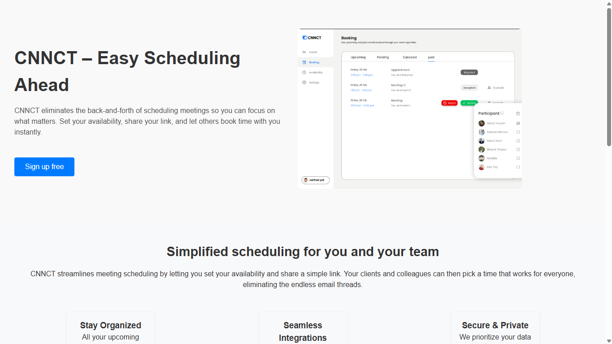
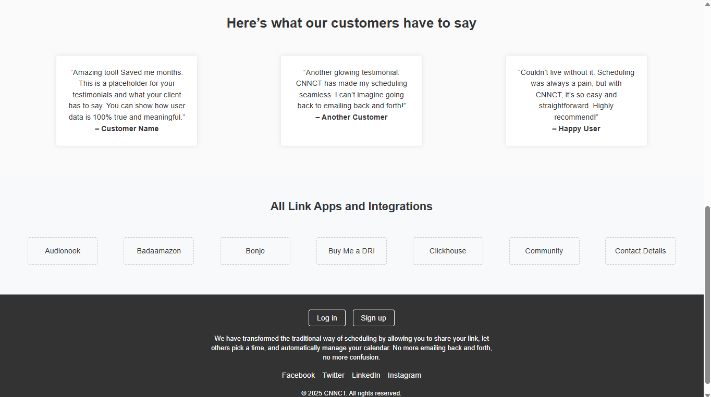
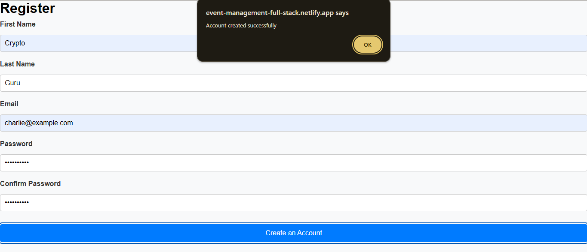
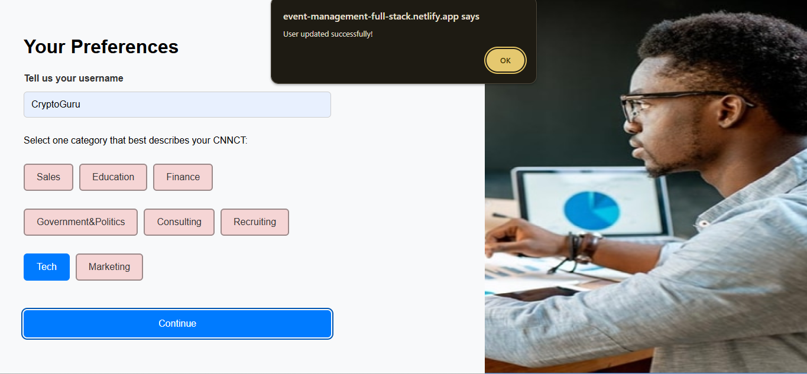
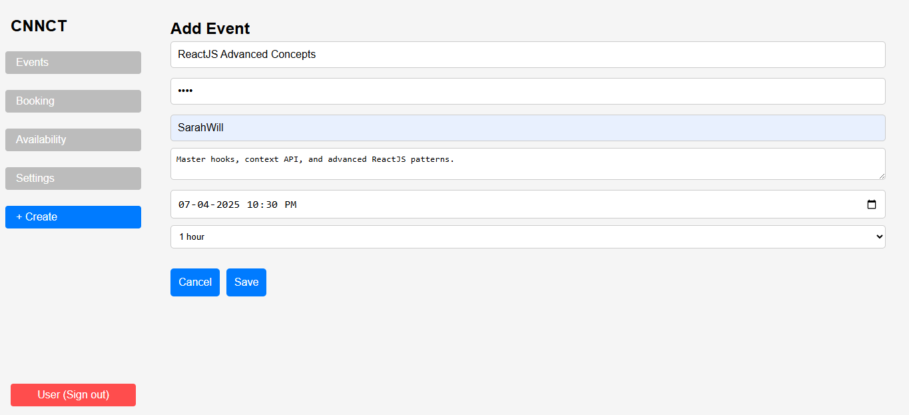
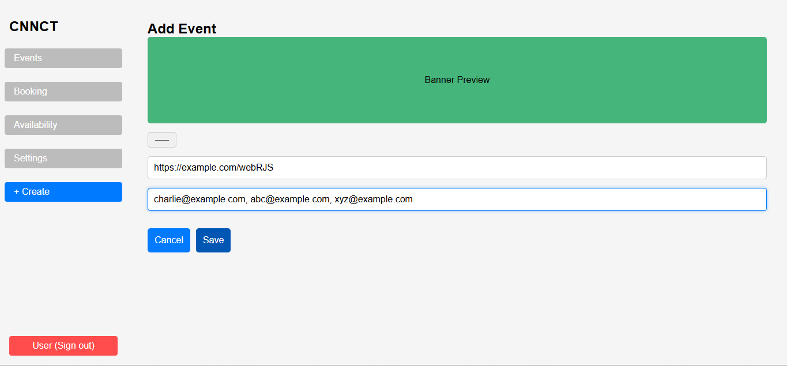
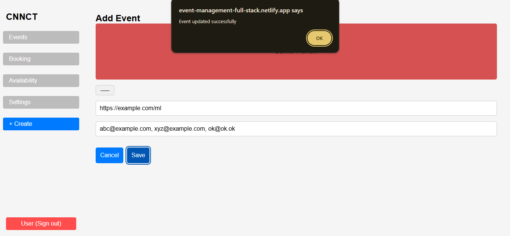
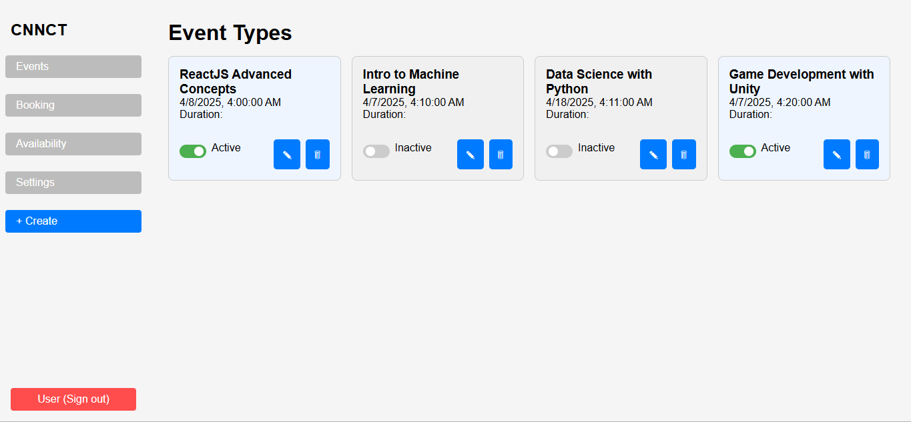
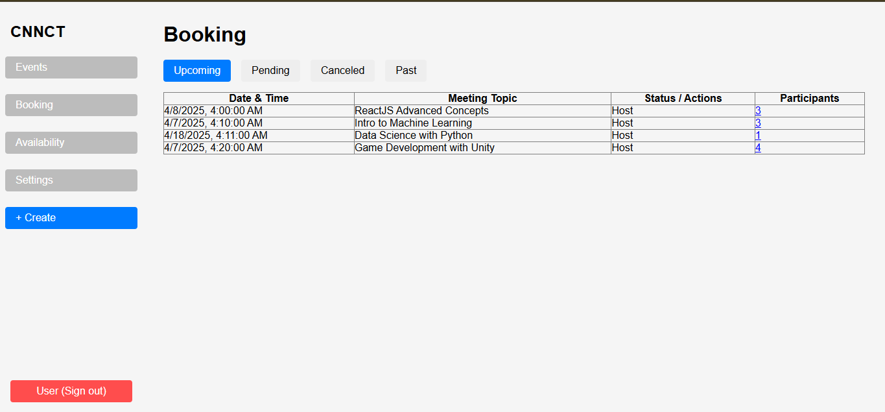
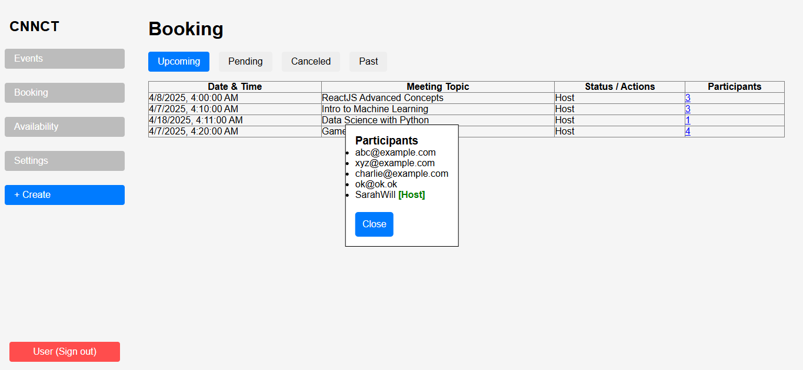
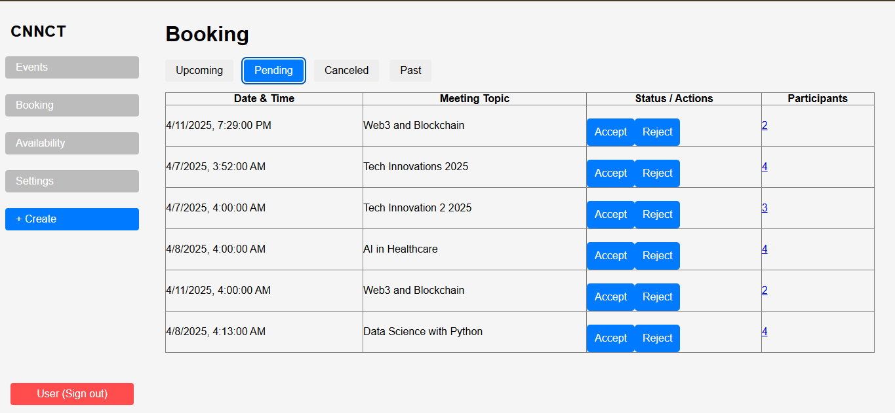
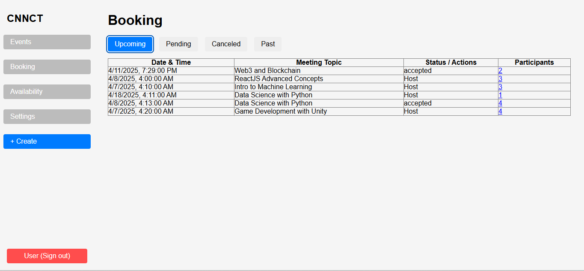
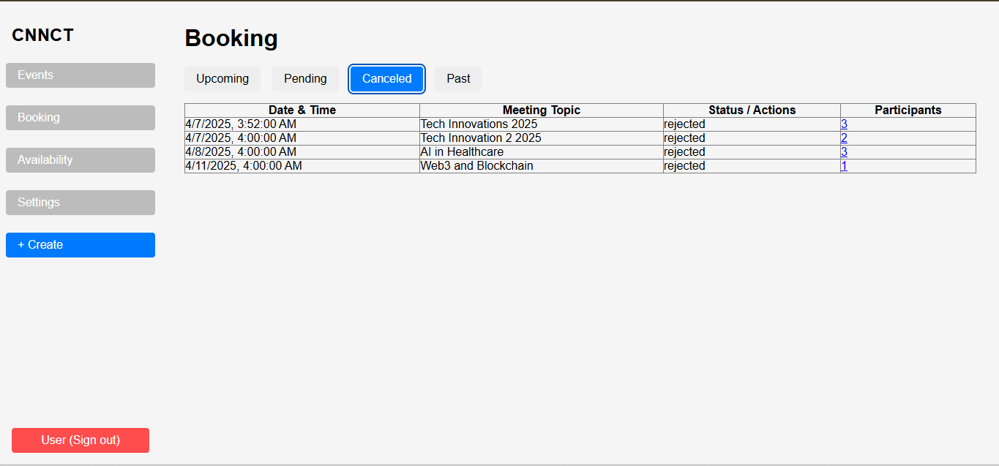
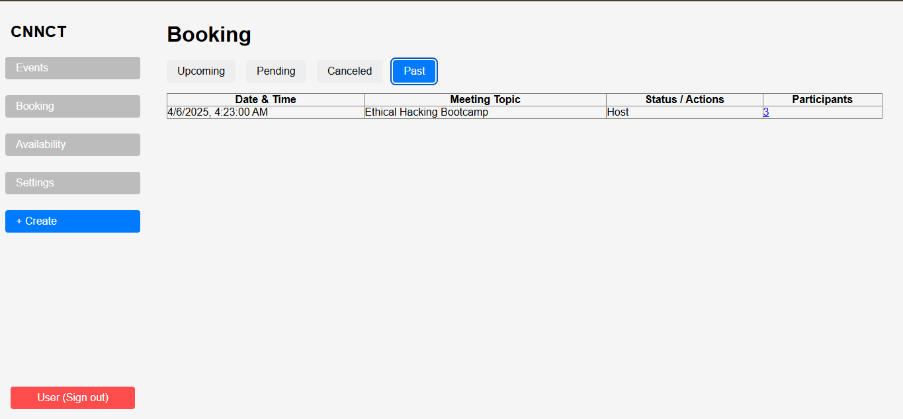
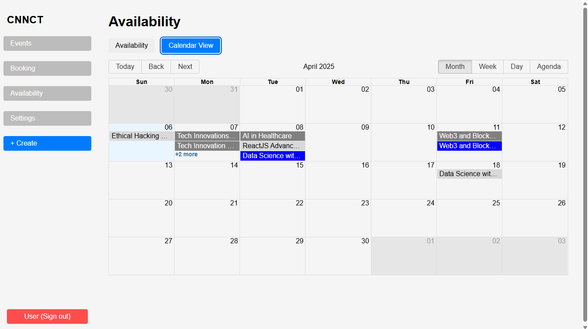
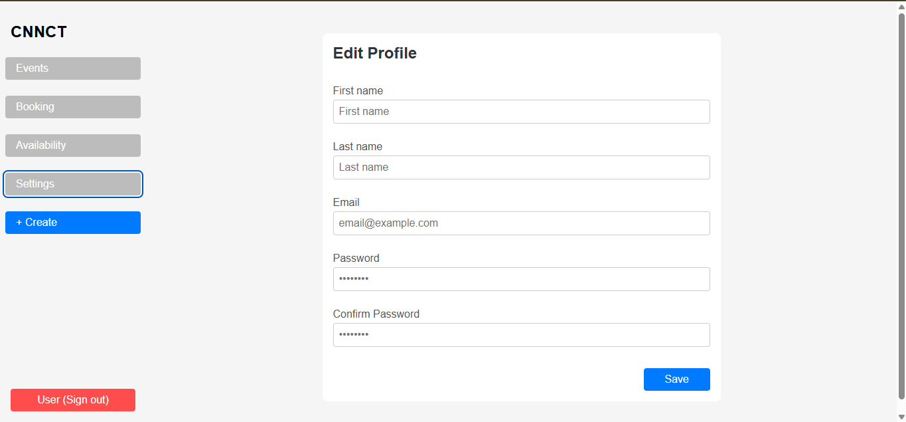
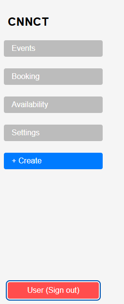
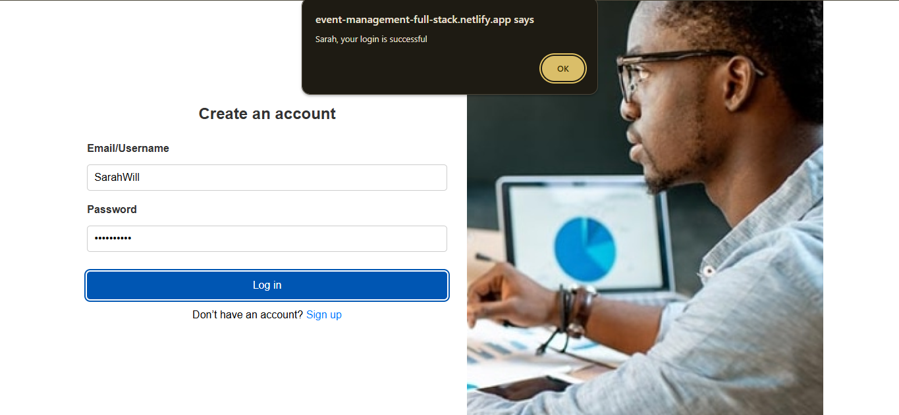
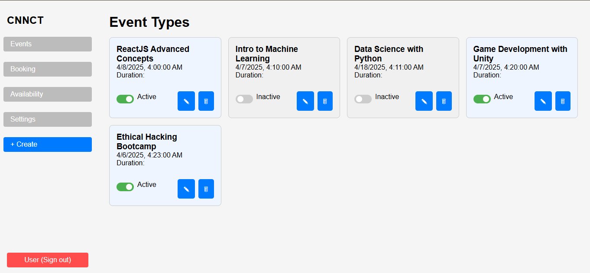

---

## 👤 Author

- Udayan Misra  
- Contact: [GitHub](https://github.com/UdayanMisra2000)
